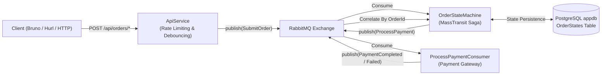
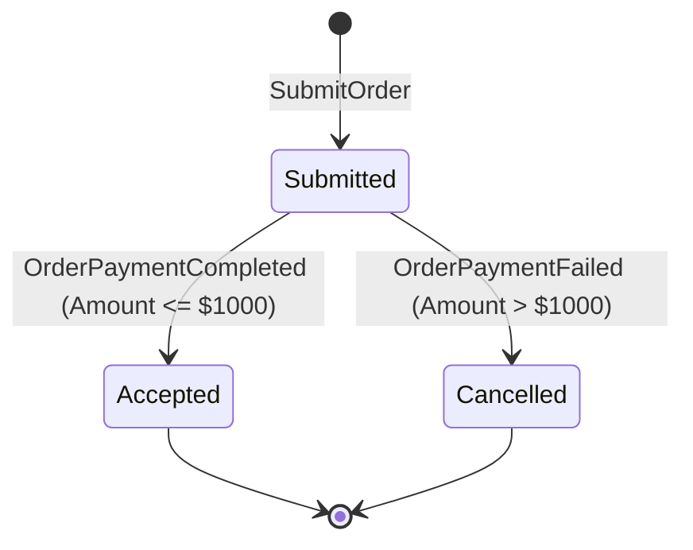

# MassTransit and .NET Aspire Demo

This project shows a small .NET 10 application that uses MassTransit, RabbitMQ, PostgreSQL, and .NET Aspire. It includes a saga state machine, an order API, and a payment consumer.

---

## Architecture and Messaging Flow



---

## Features

- MassTransit uses RabbitMQ for messaging.
- The order saga stores its state in PostgreSQL through Entity Framework Core.
- The saga uses optimistic concurrency with a `RowVersion` field.
- The API has a fixed-window rate limit of 5 requests per 10 seconds for each client.
- The debounced endpoint ignores duplicate requests received within the configured interval. The default is 500 milliseconds.
- Aspire provides health checks, telemetry, Prometheus metrics, and local service orchestration.

---

## Saga Lifecycle

The `OrderStateMachine` handles an order submission and waits for the payment result.



### Saga States & Data

Persisted in PostgreSQL table **`OrderStates`**:

| State | Trigger | Action and persisted fields |
| :--- | :--- | :--- |
| **`Submitted`** | `SubmitOrder` | Saga created; stores `CustomerNumber`, `Amount`, `CreatedAt`. Dispatches `ProcessPayment` command. |
| **`Accepted`** | `OrderPaymentCompleted` | Payment approved; stores `PaymentTransactionId` (e.g. `TXN-...`) and `CompletedAt`. |
| **`Cancelled`** | `OrderPaymentFailed` | Payment declined; stores `FailureReason` (e.g. `"Credit limit exceeded (max $1,000)."`). |

---

## API Endpoints

The order endpoints accept this JSON payload:
```json
{
  "customerNumber": "CUST-001",
  "amount": 199.99
}
```

| Method | Route | Description | Behavior |
| :--- | :--- | :--- | :--- |
| `POST` | `/api/orders` | Submit an order. | Returns `202 Accepted` with an `OrderId`. Starts the saga. |
| `POST` | `/api/orders/rate-limited` | Submit an order through the rate-limited endpoint. | Allows 5 requests per 10-second window and returns `429 Too Many Requests` after that. |
| `POST` | `/api/orders/debounced` | Submit an order through the debounced endpoint. | Suppresses rapid duplicate requests within the debounce interval. |

### Debounce configuration

Configured in `appsettings.json`:
```json
"Debounce": {
  "DefaultInterval": "00:00:00.500"
}
```

---

## Project Structure

```text
MassTransitDemo/
├── src/
│   ├── MassTransitDemo.slnx            # Modern XML Solution format (.slnx)
│   ├── MassTransitDemo.AppHost/        # Aspire Orchestrator (RabbitMQ, Postgres, Grafana, Prometheus)
│   ├── MassTransitDemo.ServiceDefaults/# Shared OpenTelemetry, Prometheus exporter, health checks
│   ├── MassTransitDemo.Contracts/      # Shared message contracts
│   │   ├── OrderEvents.cs              # SubmitOrder, OrderSubmitted
│   │   └── PaymentEvents.cs            # ProcessPayment, OrderPaymentCompleted, OrderPaymentFailed
│   ├── MassTransitDemo.ApiService/     # Web API (Message Publisher / Minimal API)
│   │   ├── Configurations/             # Options classes (DebounceOptions)
│   │   ├── Endpoints/                  # Minimal API route groups (OrderEndpoints)
│   │   ├── Helpers/                    # DebounceGuard with IMemoryCache
│   │   └── Services/                   # OrderService publisher
│   └── MassTransitDemo.Worker/         # Background Worker (Saga & Consumer)
│       ├── Consumers/                  # Step consumers (ProcessPaymentConsumer)
│       ├── StateMachines/              # OrderStateMachine, OrderState, OrderStateMap, OrderSagaDbContext
│       └── Program.cs                  # EF Core + Postgres saga registration
├── bruno/                              # Bruno API test collection
│   ├── Health/                         # Health check requests
│   ├── Orders/                         # Standard, rate-limited, and debounced order requests
│   └── Saga/                           # Saga scenario tests (Approved vs. Declined)
├── tests/
│   ├── MassTransitDemo.Tests/          # Unit tests (xUnit & MassTransit TestHarness)
│   └── hurl/                           # Hurl integration test scripts (debounced, rate-limited, saga)
├── .gitignore
└── README.md
```

---

## Prerequisites

- [.NET 10 SDK](https://dotnet.microsoft.com/download)
- [Docker Desktop](https://www.docker.com/) or [OrbStack](https://orbstack.dev/)
- [Aspire CLI](https://learn.microsoft.com/dotnet/aspire/fundamentals/setup-tooling) (`aspire` command)
- [Bruno](https://www.usebruno.com/) or [Hurl](https://hurl.dev/) (for API testing)

---

## Getting Started

### 1. Start the application

Aspire starts the API, worker, RabbitMQ, PostgreSQL, pgAdmin, Grafana, and Prometheus:

```bash
aspire run
# or
dotnet run --project src/MassTransitDemo.AppHost
```

### 2. Open the Aspire dashboard

When Aspire starts, open the dashboard URL printed in the terminal.

The dashboard shows the API, worker, RabbitMQ, PostgreSQL, and telemetry resources. It also provides links to the RabbitMQ management UI and pgAdmin.

Grafana uses `http://localhost:3000` and Prometheus uses `http://localhost:9090` when those ports are available. The local Grafana container uses anonymous admin access, so do not expose it outside your development machine.

In the Development environment, the worker creates the saga database schema on startup. This keeps the demo setup simple. A production application should use EF Core migrations instead.

---

## Testing

### Bruno collection

1. Open the [Bruno](https://www.usebruno.com/) desktop app.
2. Click **Open Collection** and select the `bruno/` directory.
3. Select the **Local** environment (`http://localhost:5142`).
4. Available requests:
   - **Saga / Order Saga - Approved** (`POST /api/orders` with `$499.00`): Executes the saga happy path ➔ payment approved ➔ transitions to `Accepted`.
   - **Saga / Order Saga - Declined** (`POST /api/orders` with `$1500.00`): Executes the saga decline path ➔ payment declined ➔ transitions to `Cancelled`.
   - **Orders / Submit Order** (`POST /api/orders`): Baseline order submission test.
   - **Orders / Rate Limited Order** (`POST /api/orders/rate-limited`): Tests submission under fixed-window rate limiting.
   - **Orders / Debounced Order** (`POST /api/orders/debounced`): Tests rapid repeat suppression.
   - **Health / Alive** (`GET /alive`): Validates Aspire health checks.

### Inspecting sagas in pgAdmin

1. Click the **pgAdmin** resource in the Aspire Dashboard.
2. Connect to the **`appdb`** database.
3. Query the saga table:
   ```sql
   SELECT "CorrelationId", "CurrentState", "CustomerNumber", "Amount", "PaymentTransactionId", "FailureReason", "CreatedAt", "CompletedAt"
   FROM "OrderStates";
   ```
4. Observe the state update in real-time as orders are submitted!

### Hurl integration tests

Automated CLI test scripts are located in `tests/hurl/`:

```bash
# Test normal submission
hurl tests/hurl/orders-normal.hurl

# Test rate limiting (verifies 5 permits succeed, 6th returns 429)
hurl tests/hurl/orders-rate-limited.hurl

# Test debouncing (verifies rapid duplicate suppression)
hurl tests/hurl/orders-debounced.hurl

# Test Saga happy path (Amount <= $1000 -> Accepted)
hurl tests/hurl/orders-saga-approved.hurl

# Test Saga declined path (Amount > $1000 -> Cancelled)
hurl tests/hurl/orders-saga-declined.hurl
```

### Unit tests

Run the unit tests locally without RabbitMQ or PostgreSQL:

```bash
dotnet test
```

The tests cover the order state machine, payment consumer, and debounce guard.

---

## Packages

- **MassTransit** (`8.3.6`) & **MassTransit.RabbitMQ** (`8.3.6`) — Messaging framework.
- **MassTransit.EntityFrameworkCore** (`8.3.6`) — PostgreSQL saga state repository provider.
- **Npgsql.EntityFrameworkCore.PostgreSQL** (`10.0.3`) — PostgreSQL EF Core database provider.
- **Aspire.Hosting.AppHost** (`13.5.3`) — Distributed application host.
- **Aspire.Hosting.RabbitMQ** (`13.5.3`) — RabbitMQ container orchestration.
- **Aspire.Hosting.PostgreSQL** (`13.5.3`) — PostgreSQL container & pgAdmin.
- **OpenTelemetry.Exporter.Prometheus.AspNetCore** — Prometheus metrics scraping endpoint.
