# MassTransit & .NET Aspire Demo

A distributed .NET 10 messaging solution demonstrating event-driven pub/sub architecture using [MassTransit](https://masstransit.io/) and orchestrated locally with [.NET Aspire](https://learn.microsoft.com/dotnet/aspire/).

---

## 🏗️ Architecture & Messaging Flow

```mermaid
flowchart LR
    Client["Client (Bruno / HTTP)"] -->|"POST /orders"| API["ApiService"]
    API -->|"publishEndpoint.Publish(SubmitOrder)"| RMQ_EX["RabbitMQ Exchange<br/>(MassTransitDemo.Contracts:SubmitOrder)"]
    RMQ_EX -->|"Route"| RMQ_Q["RabbitMQ Queue<br/>(submit-order)"]
    RMQ_Q -->|"Consume"| Worker["Worker Service<br/>(SubmitOrderConsumer)"]
    Worker -->|"context.Publish(OrderSubmitted)"| NextEvent["Next Event Subscribers"]
```



---

## 📂 Project Structure

```text
MassTransitDemo/
├── src/
│   ├── MassTransitDemo.slnx            # Modern XML Solution format (.slnx)
│   ├── MassTransitDemo.AppHost/        # Aspire Orchestrator (RabbitMQ, Postgres, Grafana)
│   ├── MassTransitDemo.ServiceDefaults/# Shared OpenTelemetry, metrics, health checks
│   ├── MassTransitDemo.Contracts/      # Shared message contracts (SubmitOrder, OrderSubmitted)
│   ├── MassTransitDemo.ApiService/     # Web API (Message Publisher / Minimal API)
│   └── MassTransitDemo.Worker/         # Background Worker (MassTransit Consumer)
├── bruno/                              # Bruno API test collection with assertions
├── .gitignore
└── README.md
```

---

## 🚀 Prerequisites

- [.NET 10 SDK](https://dotnet.microsoft.com/download)
- [Docker Desktop](https://www.docker.com/) or [OrbStack](https://orbstack.dev/)
- [Aspire CLI](https://learn.microsoft.com/dotnet/aspire/fundamentals/setup-tooling) (`aspire` command)
- [Bruno](https://www.usebruno.com/) (for executing API test requests)

---

## 🛠️ Getting Started

### 1. Start the Solution via Aspire

Aspire handles spinning up all containers (RabbitMQ, PostgreSQL, pgAdmin, Grafana) and service dependencies automatically:

```bash
aspire run
# or
dotnet run --project src/MassTransitDemo.AppHost
```

### 2. Open the Aspire Dashboard

When Aspire starts, click the dashboard URL printed in your terminal (e.g. `https://localhost:17...`).

In the dashboard, you'll find:
- **`apiservice`**: Assigned API endpoint.
- **`worker`**: Background consumer service.
- **`messaging`**: RabbitMQ instance with a direct link to the **RabbitMQ Management UI**.
- **`postgres` & `appdb`**: PostgreSQL database with a link to **pgAdmin**.
- **`grafana`**: Visualization container (`http://localhost:3000`).
- **Distributed Traces & Structured Logs**: Real-time OpenTelemetry tracking from the HTTP request to the consumer.

---

## 🧪 Testing with Bruno

An automated API test suite is included in the `bruno/` directory.

1. Open the [Bruno](https://www.usebruno.com/) desktop app.
2. Click **Open Collection** and select the `bruno/` folder in this repository.
3. Select the **Local** environment (top right).
4. Run:
   - **Submit Order** (`POST /orders`): Publishes a new order event and asserts a `202 Accepted` response with an auto-generated `orderId`.
   - **Health Check** (`GET /alive`): Validates Aspire health checks.
5. Watch the live message processing in the Aspire Dashboard console logs and trace waterfalls!

---

## 📦 Key Packages Used

- **MassTransit** (`8.3.6`) & **MassTransit.RabbitMQ** (`8.3.6`) — Apache 2.0 Open-Source messaging framework.
- **Aspire.Hosting.AppHost** (`13.5.3`) — Distributed application host.
- **Aspire.Hosting.RabbitMQ** (`13.5.3`) — RabbitMQ container orchestration.
- **Aspire.Hosting.PostgreSQL** (`13.5.3`) — PostgreSQL container & pgAdmin.
