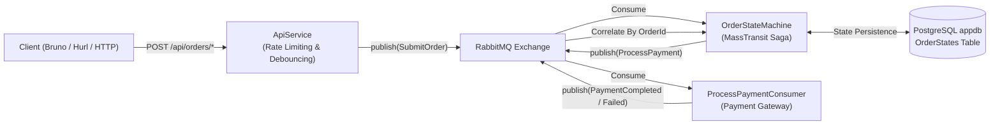
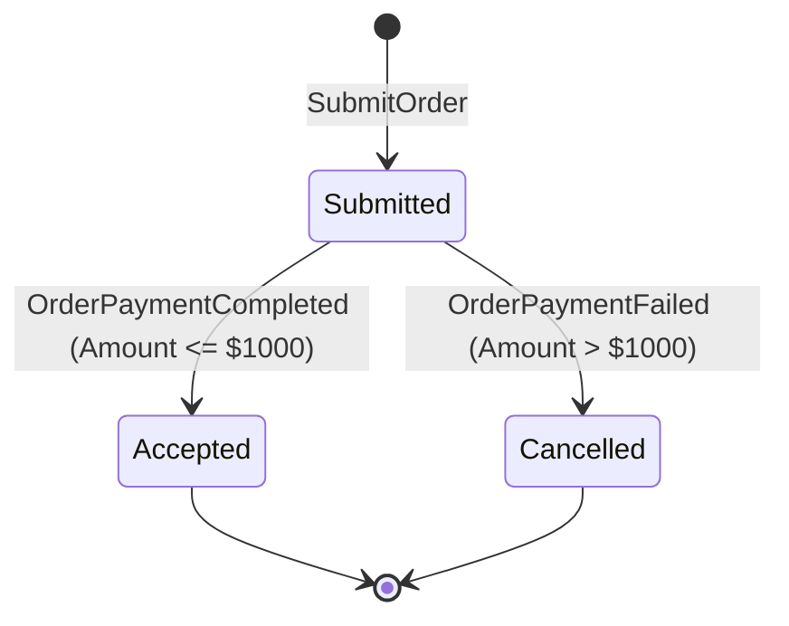

# MassTransit & .NET Aspire Demo

A distributed .NET 10 messaging solution demonstrating event-driven pub/sub architecture and **Saga State Machine orchestration** using [MassTransit](https://masstransit.io/), backed by **PostgreSQL** and orchestrated locally with [.NET Aspire](https://learn.microsoft.com/dotnet/aspire/).

---

## 🏗️ Architecture & Messaging Flow



---

## 🚀 Key Features

- **Event-Driven Messaging**: MassTransit RabbitMQ pub/sub integration.
- **Saga State Machine Orchestration**: Long-running distributed order transaction management with automated state transitions, event correlation, and compensation logic.
- **Durable Saga Persistence**: State machine instances persisted to **PostgreSQL (`appdb`)** using **Entity Framework Core** with optimistic concurrency (`RowVersion`).
- **Fixed Window Rate Limiting**: Protects endpoints against traffic spikes using ASP.NET Core rate limiting (`5 requests / 10s` per client IP / user, zero queue for instant rejection with `429 Too Many Requests`).
- **Request Debouncer**: In-memory caching guard (`DebounceGuard`) that suppresses rapid duplicate submissions within a configurable interval (default `500ms`), preventing double-submits.
- **Observability & Health Checks**: OpenTelemetry metrics, Prometheus exporter, Grafana dashboards, and Aspire distributed tracing.

---

## 🔄 Saga Lifecycle & State Transitions

The `OrderStateMachine` manages the lifecycle of each order from submission through payment verification:



### Saga States & Data

Persisted in PostgreSQL table **`OrderStates`**:

| State | Trigger | Action / Persisted Fields |
| :--- | :--- | :--- |
| **`Submitted`** | `SubmitOrder` | Saga created; stores `CustomerNumber`, `Amount`, `CreatedAt`. Dispatches `ProcessPayment` command. |
| **`Accepted`** | `OrderPaymentCompleted` | Payment approved; stores `PaymentTransactionId` (e.g. `TXN-...`) and `CompletedAt`. |
| **`Cancelled`** | `OrderPaymentFailed` | Payment declined; stores `FailureReason` (e.g. `"Credit limit exceeded (max $1,000)."`). |

---

## 📡 API Endpoints

All order endpoints accept a JSON payload:
```json
{
  "customerNumber": "CUST-001",
  "amount": 199.99
}
```

| Method | Route | Description | Resilience Behavior |
| :--- | :--- | :--- | :--- |
| `POST` | `/api/orders` | Standard order submission | Direct submission; returns `202 Accepted` with generated `OrderId`. Triggers the Saga. |
| `POST` | `/api/orders/rate-limited` | Rate-limited order submission | Protected by `orders-fixed` policy (5 requests / 10s window). Returns `429 Too Many Requests` when exceeded. |
| `POST` | `/api/orders/debounced` | Debounced order submission | Guarded by `DebounceGuard`. Rapid duplicate submissions within the debounce interval (500ms) are suppressed (`202 Accepted` with suppression message). |

### Debounce Configuration

Configured in `appsettings.json`:
```json
"Debounce": {
  "DefaultInterval": "00:00:00.500"
}
```

---

## 📂 Project Structure

```text
MassTransitDemo/
├── src/
│   ├── MassTransitDemo.slnx            # Modern XML Solution format (.slnx)
│   ├── MassTransitDemo.AppHost/        # Aspire Orchestrator (RabbitMQ, Postgres, Grafana, Prometheus)
│   ├── MassTransitDemo.ServiceDefaults/# Shared OpenTelemetry, Prometheus exporter, health checks
│   ├── MassTransitDemo.Contracts/      # Shared message contracts
│   │   ├── OrderEvents.cs              # SubmitOrder, OrderSubmitted
│   │   └── PaymentEvents.cs            # ProcessPayment, OrderPaymentCompleted, OrderPaymentFailed
│   ├── MassTransitDemo.ApiService/     # Web API (Message Publisher / Minimal API)
│   │   ├── Configurations/             # Options classes (DebounceOptions)
│   │   ├── Endpoints/                  # Minimal API route groups (OrderEndpoints)
│   │   ├── Helpers/                    # DebounceGuard with IMemoryCache
│   │   └── Services/                   # OrderService publisher
│   └── MassTransitDemo.Worker/         # Background Worker (Saga & Consumer)
│       ├── Consumers/                  # Step consumers (ProcessPaymentConsumer)
│       ├── StateMachines/              # OrderStateMachine, OrderState, OrderStateMap, OrderSagaDbContext
│       └── Program.cs                  # EF Core + Postgres saga registration
├── bruno/                              # Bruno API test collection
│   ├── Health/                         # Health check requests
│   ├── Orders/                         # Standard, rate-limited, and debounced order requests
│   └── Saga/                           # Saga scenario tests (Approved vs. Declined)
├── tests/
│   ├── MassTransitDemo.Tests/          # Unit tests (xUnit & MassTransit TestHarness)
│   └── hurl/                           # Hurl integration test scripts (debounced, rate-limited, saga)
├── .gitignore
└── README.md
```

---

## 🛠️ Prerequisites

- [.NET 10 SDK](https://dotnet.microsoft.com/download)
- [Docker Desktop](https://www.docker.com/) or [OrbStack](https://orbstack.dev/)
- [Aspire CLI](https://learn.microsoft.com/dotnet/aspire/fundamentals/setup-tooling) (`aspire` command)
- [Bruno](https://www.usebruno.com/) or [Hurl](https://hurl.dev/) (for API testing)

---

## 🏃 Getting Started

### 1. Start the Solution via Aspire

Aspire spins up all containers (RabbitMQ, PostgreSQL, pgAdmin, Grafana, Prometheus) and service dependencies automatically:

```bash
aspire run
# or
dotnet run --project src/MassTransitDemo.AppHost
```

### 2. Open the Aspire Dashboard

When Aspire starts, click the dashboard URL printed in your terminal (e.g. `https://localhost:17...`).

In the dashboard, you'll find:
- **`apiservice`**: Assigned API endpoint.
- **`worker`**: Background saga orchestrator and consumer service.
- **`messaging`**: RabbitMQ instance with a direct link to the **RabbitMQ Management UI**.
- **`postgres` & `appdb`**: PostgreSQL database with a link to **pgAdmin**.
- **`grafana`**: Visualization container (`http://localhost:3000`).
- **`prometheus`**: Metrics scraper (`http://localhost:9090`).
- **Distributed Traces & Structured Logs**: Real-time OpenTelemetry tracking across the entire saga pipeline.

---

## 🧪 Testing

### Option 1: Bruno Collection

1. Open the [Bruno](https://www.usebruno.com/) desktop app.
2. Click **Open Collection** and select the `bruno/` directory.
3. Select the **Local** environment (`http://localhost:5142`).
4. Available requests:
   - **Saga / Order Saga - Approved** (`POST /api/orders` with `$499.00`): Executes the saga happy path ➔ payment approved ➔ transitions to `Accepted`.
   - **Saga / Order Saga - Declined** (`POST /api/orders` with `$1500.00`): Executes the saga decline path ➔ payment declined ➔ transitions to `Cancelled`.
   - **Orders / Submit Order** (`POST /api/orders`): Baseline order submission test.
   - **Orders / Rate Limited Order** (`POST /api/orders/rate-limited`): Tests submission under fixed-window rate limiting.
   - **Orders / Debounced Order** (`POST /api/orders/debounced`): Tests rapid repeat suppression.
   - **Health / Alive** (`GET /alive`): Validates Aspire health checks.

### Option 2: Inspecting Sagas in pgAdmin

1. Click the **pgAdmin** resource in the Aspire Dashboard.
2. Connect to the **`appdb`** database.
3. Query the saga table:
   ```sql
   SELECT "CorrelationId", "CurrentState", "CustomerNumber", "Amount", "PaymentTransactionId", "FailureReason", "CreatedAt", "CompletedAt"
   FROM "OrderStates";
   ```
4. Observe the state update in real-time as orders are submitted!

### Option 3: Hurl Integration Tests

Automated CLI test scripts are located in `tests/hurl/`:

```bash
# Test normal submission
hurl tests/hurl/orders-normal.hurl

# Test rate limiting (verifies 5 permits succeed, 6th returns 429)
hurl tests/hurl/orders-rate-limited.hurl

# Test debouncing (verifies rapid duplicate suppression)
hurl tests/hurl/orders-debounced.hurl

# Test Saga happy path (Amount <= $1000 -> Accepted)
hurl tests/hurl/orders-saga-approved.hurl

# Test Saga declined path (Amount > $1000 -> Cancelled)
hurl tests/hurl/orders-saga-declined.hurl
```

### Option 4: Local Unit Tests (xUnit & MassTransit TestHarness)

Run all unit tests locally without external infrastructure (in-memory bus and state machine harness):

```bash
dotnet test
```

This validates:
- **`OrderStateMachineTests`**: State creation, event transitions (`Submitted` ➔ `Accepted` / `Cancelled`), and published commands.
- **`ProcessPaymentConsumerTests`**: Business rules for approvals vs. declines.
- **`DebounceGuardTests`**: Time-window locking and expiration.

---

## 📦 Key Packages Used

- **MassTransit** (`8.3.6`) & **MassTransit.RabbitMQ** (`8.3.6`) — Messaging framework.
- **MassTransit.EntityFrameworkCore** (`8.3.6`) — PostgreSQL saga state repository provider.
- **Npgsql.EntityFrameworkCore.PostgreSQL** (`10.0.3`) — PostgreSQL EF Core database provider.
- **Aspire.Hosting.AppHost** (`13.5.3`) — Distributed application host.
- **Aspire.Hosting.RabbitMQ** (`13.5.3`) — RabbitMQ container orchestration.
- **Aspire.Hosting.PostgreSQL** (`13.5.3`) — PostgreSQL container & pgAdmin.
- **OpenTelemetry.Exporter.Prometheus.AspNetCore** — Prometheus metrics scraping endpoint.
